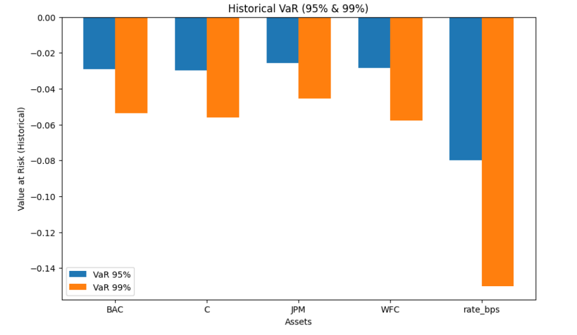
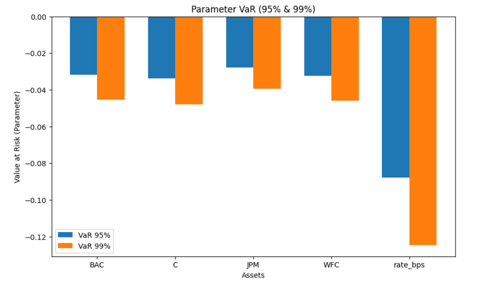

# Impact of Interest Rate Shocks on Bank Stock Risk

**Author:** Ke Zhang  
**Audience:** Recruiters & Financial Industry Professionals  
**Last updated:** 2025-09-21

This repository contains a risk-analysis study of how **interest-rate shocks** affect the **risk of large U.S. bank equities** (JPM, BAC, C, WFC). It integrates data collection, statistical methods, descriptive analysis, volatility modeling, VaR computation, and backtesting.  

> **Executive takeaway:** Bank equity returns are **heavy-tailed**, show **persistent volatility clustering**, and display **leverage effects**. Among tested models, **GJR-GARCH(1,1)** produced the most accurate 99% VaR coverage in backtests, while Gaussian/EWMA approaches underestimated tail risk.

---

## 1) Data Collection and Processing

- **Data:** Daily adjusted close prices for JPM, BAC, C, WFC (Yahoo Finance) and 10-year Treasury yield (FRED).  
- **Processing:**  
  - Merged on trading days (non-trading days removed).  
  - Stock log-returns computed as \( \ln(P_t/P_{t-1}) \).  
  - Interest-rate changes converted to basis points.  
- **Portfolio:** Equal-weighted basket of 4 banks.  
- **Rationale:** Align stock returns with rate changes to test whether interest-rate shocks amplify bank stock risk.

---

## 2) Descriptive Statistics and Correlation

<div align="center">
<br/>
<em>Scatterplot matrix of stock returns and rate changes</em>
</div>

**Correlation Matrix (daily log-returns vs. rate changes):**

|        | BAC   | C     | JPM   | WFC   | Rate (bps) |
|:------:|:-----:|:-----:|:-----:|:-----:|:----------:|
| **BAC**| 1.0000| 0.8738| 0.8921| 0.8319| 0.3446     |
| **C**  | 0.8738| 1.0000| 0.8624| 0.7973| 0.2783     |
| **JPM**| 0.8921| 0.8624| 1.0000| 0.8127| 0.3298     |
| **WFC**| 0.8319| 0.7973| 0.8127| 1.0000| 0.3015     |
| **Rate**|0.3446| 0.2783| 0.3298| 0.3015| 1.0000     |

**Interpretation:**  
- Intra-bank correlations ≈0.8–0.9 → common industry/macro risk drivers.  
- Correlations with rate shocks ≈0.28–0.34 → rates affect banks, but not the only driver.  

---

## 3) Value-at-Risk (VaR) Analysis

Two 1-day VaR approaches are compared at 95% and 99% confidence:

- **Historical (non-parametric):** Empirical quantiles of returns.  
- **Parametric (Gaussian):** \( \text{VaR}_\alpha = \mu + \sigma \Phi^{-1}(\alpha) \).  

**Table 2. Historical vs. Parametric 1-day VaR**

| Asset                | VaR 95% (Hist) | VaR 99% (Hist) | Mean (μ)  | σ      | VaR 95% (Norm) | VaR 99% (Norm) |
|---------------------|----------------:|---------------:|----------:|-------:|---------------:|---------------:|
| BAC                 | -0.029          | -0.054         | 0.000443  | 0.020  | -0.032         | -0.045         |
| C                   | -0.030          | -0.056         | 0.000211  | 0.021  | -0.034         | -0.048         |
| JPM                 | -0.026          | -0.046         | 0.000646  | 0.017  | -0.028         | -0.040         |
| WFC                 | -0.028          | -0.058         | 0.000215  | 0.020  | -0.032         | -0.046         |
| Interest Rate (bps) | -0.080          | -0.150         | 0.000985  | 0.054  | -0.088         | -0.125         |
| Portfolio (EW)      | -0.027          | -0.047         | –         | –      | -0.030         | -0.042         |

<div align="center">

<br/>
<em>Historical vs. Parametric VaR results</em>
</div>

**Interpretation:**  
- Historical VaR shows larger (more conservative) losses due to fat tails.  
- Gaussian VaR underestimates extreme losses → risk of under-capitalization.  

---

## 4) Return Distribution and Normality (H1)

**Jarque–Bera test results (all p≈0):**

| Ticker | Mean  | σ      | Skewness | Excess Kurtosis | JB Statistic | JB p-value |
|:-----:|------:|-------:|---------:|----------------:|-------------:|-----------:|
| BAC   | 0.0004| 0.0197 | -0.0175  | 9.5353          | 9417.31      | 0.0        |
| C     | 0.0002| 0.0207 | -0.4642  | 14.0810         | 20628.72     | 0.0        |
| JPM   | 0.0006| 0.0173 | -0.0254  | 13.3782         | 18540.26     | 0.0        |
| WFC   | 0.0002| 0.0199 | -0.2198  | 9.1837          | 8755.40      | 0.0        |

<div align="center">
<br/>
<em>Distributions showing fat tails vs Normal assumption</em>
</div>

**Interpretation:** All series reject Normality → fat tails → parametric Normal VaR is invalid.  

---

## 5) Volatility Clustering (H2)

<div align="center">
<br/>
<em>ACF of BAC returns vs squared returns (volatility clustering)</em>
</div>

<div align="center">
<br/>
<em>BAC daily returns with conditional volatility overlay</em>
</div>

<div align="center">
<br/>
<em>21-day rolling volatility of bank stocks</em>
</div>

<div align="center">
<br/>
<em>EWMA volatility estimates</em>
</div>

**Table 4. GARCH(1,1) parameters**

| Ticker | μ       | ω        | α (ARCH) | β (GARCH) | α+β   | JB p | Ljung-Box p | ARCH-LM p |
|:-----:|:-------:|:--------:|:--------:|:---------:|:-----:|:----:|:-----------:|:---------:|
| BAC   | 0.000443| 0.000039 | 0.050000 | 0.900000  | 0.950 | 0.0  | 0.0         | 0.0       |
| C     | 0.000595| 0.000043 | 0.050881 | 0.898854  | 0.950 | 0.0  | 0.0         | 0.0       |
| JPM   | 0.000646| 0.000030 | 0.050000 | 0.900000  | 0.950 | 0.0  | 0.0         | 0.0       |
| WFC   | 0.000215| 0.000039 | 0.050000 | 0.900000  | 0.950 | 0.0  | 0.0         | 0.0       |

**Interpretation:**  
- Strong volatility clustering (confirmed by ACF, ARCH tests).  
- GARCH α+β ≈ 0.95 → volatility is highly persistent.  

---

## 6) Asymmetric Volatility (H3)

<div align="center">
<br/>
<em>Conditional volatility comparison: symmetric GARCH vs asymmetric EGARCH/GJR</em>
</div>

**Table 5. Example parameter estimates**

| Model            | μ      | ω       | α       | γ (leverage) | β     | LLF       |
|------------------|:------:|:-------:|:-------:|:------------:|:-----:|----------:|
| GARCH(1,1)       | 0.0004 | 0.0000  | 0.0500  | –            | 0.90  | 6370.38   |
| GJR-GARCH(1,1)   | 0.0004 | 0.0000  | 0.0500  | 0.0500       | 0.90  | 6538.63   |
| EGARCH(1,1)      | 0.0006 | -0.3993 | 0.1694  | -0.1094      | 0.95  | 6620.40   |

**Interpretation:** EGARCH shows significant negative γ (leverage effect) → negative shocks increase volatility more than positive ones.  

---

## 7) VaR Backtesting & Validation (H4)

**Table 7. VaR Violations vs Expected**

| Model                         | Violations / N | Expected |
|-------------------------------|:--------------:|:--------:|
| Historical (250-day window)   | 33 / 2248      | ~22      |
| EWMA (λ=0.94, parametric)     | 57 / 2497      | ~24      |
| GARCH(1,1) (parametric)       | 11 / 2497      | ~24      |
| GJR-GARCH(1,1) (parametric)   | 21 / 2497      | ~24      |
| EGARCH(1,1) (parametric)      | 40 / 2497      | ~24      |

**Interpretation:**  
- EWMA & EGARCH under-estimate risk (too many breaches).  
- GARCH(1,1) too conservative (too few breaches).  
- GJR-GARCH closest to expected → most accurate coverage.

---

## 8) Conclusions

- **Heavy tails:** Gaussian VaR is too optimistic → use historical/fat-tailed models.  
- **Volatility persistence:** α+β ≈ 0.95 → shocks fade slowly.  
- **Leverage effect:** Negative shocks amplify volatility → asymmetric GARCH preferred.  
- **Backtesting:** GJR-GARCH passes 99% VaR tests → best balance between accuracy & conservatism.  

---

## 9) Repository Guide

```
├─ README.md                # You are here
├─ figs/                    # Figures from analysis
├─ data/                    # (optional) Raw or processed datasets
├─ notebooks/               # (optional) Source notebooks/scripts
└─ src/                     # (optional) Functions for VaR, GARCH, backtests
```

---

## References

- Kupiec, P. (1995). *Techniques for Verifying the Accuracy of Risk Measurement Models.*  
- Christoffersen, P. (1998). *Evaluating Interval Forecasts.*  
- McNeil, A. J., Frey, R., & Embrechts, P. (2015). *Quantitative Risk Management.*  
- Data sources: Yahoo Finance (prices), FRED (DGS10 yields).  

